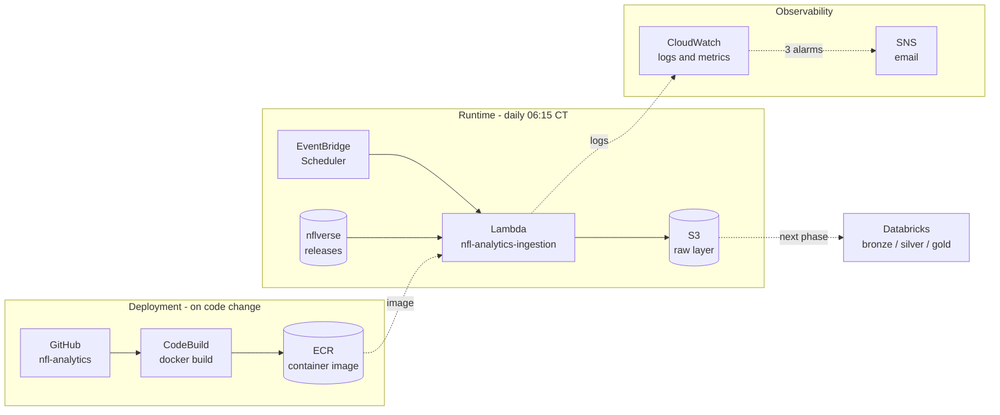

# NFL Analytics Pipeline

Daily ingestion of NFL play-by-play and player data from [nflverse](https://github.com/nflverse)
into an S3 data lake. Runs as a containerized Lambda, built in AWS, with alerting when it
breaks.

Next phase is a Databricks pipeline turning the raw layer into bronze/silver/gold tables.

**Stack:** Python 3.12, Polars, Lambda, ECR, CodeBuild, S3, EventBridge, CloudWatch, SNS

## Architecture



CodeBuild only runs when code changes. The Lambda runs daily and never touches a build.

## What it pulls

Six nflverse datasets, written as raw Parquet with no transformation: `pbp` (1999–),
`players`, `teams`, `nextgen_stats` (2016–), `pfr_advstats` (2018–), and `participation`
(2016–).

Start years differ per source, so a full-history request gets clamped to what each one
actually has. `participation` always trails the current season by a year and only updates
annually, so it's excluded from the daily run.

## Data layout

```
s3://jackc-nfl-analytics-datalake/raw/
  pbp/season=2026/ingest_date=2026-09-26/pbp_2026.parquet
  nextgen_stats/stat_type=passing/season=2026/ingest_date=2026-09-26/nextgen_stats_passing_2026.parquet
  players/ingest_date=2026-09-26/players.parquet
```

Season comes before ingest_date so every snapshot of a season stays together. Datasets that
aren't season-scoped skip that level.

## Why it's built this way

### Glue didn't work

This started as a Glue Python Shell job, which looked right for a small non-distributed
script billed at 1/16 DPU. It can't run the code. Python Shell is stuck on Python 3.9 and
nflreadpy needs 3.10+. Pip reports the package as nonexistent rather than flagging a version
conflict, so it took a while to see what was actually wrong.

Glue Spark would have worked with Glue 6.0, as it runs Python 3.11. However this job has no real need
for the overhead that comes with spark code. I skipped it because provisioning a 2-DPU Spark
cluster to make ten HTTP calls and write 15MB is the wrong tool. The finished function runs in under two seconds.

### Container instead of a zip

Polars is too large for Lambda's 250MB zip limit. Containers allow 10GB.

The better reason is that the image pins the runtime and every dependency, so there's no
drift between local and deployed. That bit me early: an outdated local nflreadpy was missing
`load_pfr_advstats` entirely and returned a different shape from `load_teams`. The version is
pinned in requirements.txt now.

### CodeBuild does the building

There's no Docker on my machine and none needed. CodeBuild clones the repo, builds the image,
pushes to ECR, and updates the function. The project has to use EC2 compute with Privileged
enabled; Lambda-backed CodeBuild can't build images because it has no root.

### Images tagged by commit SHA, not `:latest`

Lambda resolves an image to a digest when you deploy it. Push a new image to the same
`:latest` tag and the function keeps running the old one. Tagging by commit gives every build
a distinct URI and ties whatever's running back to a specific commit. A lifecycle policy
keeps the last five images.

### The raw layer is append-only

Each run writes a new `ingest_date` partition instead of overwriting the previous file.

nflverse revises past weeks as stat corrections come in. Overwriting would hide those
revisions and make it impossible to rebuild from a known point. It also keeps Auto Loader
working downstream, since it skips files it has already consumed.

### The bucket comes from the environment

`BUCKET` is an environment variable with no default in the code. That keeps the name out of a
public repo, lets the same image run against different buckets, and fails immediately if it's
missing instead of writing somewhere unintended.

An event payload overrides it, so a one-off run can target somewhere else without editing the
function config.

### The backfill ran locally

Lambda caps a run at 15 minutes and 27 seasons of play-by-play doesn't fit. Rather than
building chunking and checkpointing for something that runs once, I ran it from my laptop
against the same bucket. The script checks whether it's in Lambda and parses the same
parameters as CLI flags when it isn't.

### Empty results warn instead of failing

An earlier version failed the run when a dataset wrote zero rows, which lumps two different
things together.

Asking a source for a season it doesn't cover legitimately returns nothing, and that's
correct behavior. Separately, a source that was queried and came back empty might be a broken
feed or might be a quiet week. Neither is a crash.

So each ingestor returns `(attempts, rows)`. No attempts is a skip. Attempts with no rows logs
`EMPTY_DATASET` and trips its own alarm while the run still succeeds. Real exceptions still
fail the invocation.

### Three alarms

| Alarm | Fires when |
|---|---|
| `Errors > 0` | a dataset threw, the job is broken |
| `EmptyDatasets > 0` | a source went quiet, worth a look |
| `Invocations < 1` | the schedule never fired |

The third treats missing data as breaching because silence is the symptom. The other two
treat missing data as healthy.

## Components

| Resource | Name |
|---|---|
| S3 bucket | `jackc-nfl-analytics-datalake` |
| ECR repository | `nfl-analytics-ingestion`, lifecycle keeps 5 images |
| CodeBuild project | `nfl-analytics-ingestion-build`, EC2 + privileged |
| Lambda | `nfl-analytics-ingestion`, container, 2048 MB, 900s timeout |
| Schedule | EventBridge Scheduler, `cron(15 6 * * ? *)` America/Chicago |
| Alerts | SNS topic with email subscription |

IAM is scoped per resource: the Lambda role reaches one bucket, the CodeBuild role pushes to
one ECR repository and updates one function.

## Running it

**Deploy:** push to `main`, then Start build in CodeBuild. The build updates the function.

**Invoke** with an event payload, all keys optional:

```json
{}                                        // daily default
{"datasets": "teams"}
{"datasets": "all", "seasons": "2024"}
```

**Locally:**

```bash
pip install -r ingestion/requirements.txt
python ingestion/NflAnalyticsDataPull.py --BUCKET <bucket> --DATASETS teams
```

Full backfill, which won't fit in Lambda's timeout:

```bash
python ingestion/NflAnalyticsDataPull.py --BUCKET <bucket> --SEASONS all --DATASETS all
```

A default run takes about two seconds and peaks around 250MB. Memory is provisioned well
above that because Lambda scales CPU with memory and the cost difference is negligible.

## Known gaps

`pfr_advstats` have genuinely different schemas — passing, receiving and rushing share only
11 of 29/23/22 columns — so each needs its own bronze table rather than a union.

**Infrastructure is console-created, not code.** Everything above was built by hand in the
AWS console, so it isn't reproducible or version controlled. Defining it in Terraform is the
obvious next step.

**The schedule should be off in the offseason.** nflverse stops changing after February, and
once the season rolls over the empty-result notifications start.

## Next

A Databricks Lakeflow pipeline over the raw layer: bronze through Auto Loader, silver with
deduplication and quality expectations routing bad rows to quarantine, gold aggregates on
top.
