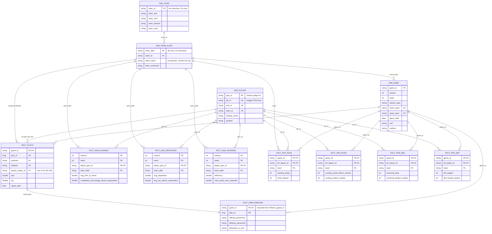

# Silver data model

Facts and conformed dimensions for the silver layer. Keys verified against 2025
data rather than assumed.

## Diagram

## Grain

| Table | Grain |
|---|---|
| `fact_plays` | game + play |
| `fact_participation` | game + play |
| `fact_ngs_*` | season + week + player |
| `fact_pfr_*` | game + player |
| `dim_game` | game |
| `dim_player` | player |
| `dim_team` | franchise (`team_id`) |
| `dim_team_alias` | team abbreviation |

## Join keys

| From | To | On |
|---|---|---|
| `fact_plays` | `dim_game` | `game_id` |
| `fact_plays` | `dim_team_alias` | `posteam`, `defteam` → `team_abbr` |
| `fact_plays` | `dim_player` | any of 43 `*_player_id` → `gsis_id` |
| `fact_participation` | `fact_plays` | `game_id` + `play_id` |
| `fact_ngs_*` | `dim_player` | `player_gsis_id` → `gsis_id` |
| `fact_ngs_*` | `dim_team_alias` | `team_abbr` |
| `dim_team_alias` | `dim_team` | `team_id` |
| `fact_pfr_*` | `dim_player` | `pfr_player_id` → **`pfr_id`** |
| `fact_pfr_*` | `dim_game` | `game_id` |

## Notes on the model

**`dim_player` is what makes this join at all.** The three sources arrive with
three different player identifiers — pbp and Next Gen Stats use nflverse `gsis`
ids, PFR uses its own. The players table happens to be an ID crosswalk, carrying
`gsis_id`, `pfr_id`, `esb_id`, `espn_id`, `pff_id`, `otc_id`, `smart_id` and
`nfl_id` side by side.

That makes it the conformed dimension in the Kimball sense: PFR facts and Next
Gen facts can be compared for the same player only because both resolve through
it. Drop that table and PFR becomes an island.

**`fact_plays` is a role-playing dimension case.** It carries 43 separate
`*_player_id` columns — passer, rusher, receiver, tackler, kicker, penalty, and
so on. Each is a distinct FK into `dim_player`, describing a different role in
the same play. Joining all 43 at once is never the point; you join whichever
role the question is about.

Same pattern with the team dimension, which `fact_plays` references four ways:
`posteam`, `defteam`, `home_team`, `away_team`.

**The team dimension is split in two, because an abbreviation is not a team.**
`load_teams()` returns 36 rows for 32 franchises. Three have more than one
abbreviation, all from relocations:

| `team_id` | Franchise | Abbreviations |
|---|---|---|
| 2510 | Rams | `LA`, `LAR`, `STL` |
| 2520 | Raiders | `LV`, `OAK` |
| 4400 | Chargers | `LAC`, `SD` |

And the sources disagree about which to use. Play-by-play writes `LA` for the
Rams; Next Gen Stats writes `LAR`. Joining facts on `team_abbr` drops those rows
silently — 22 of 559 NGS keys in 2025 failed to find a game for exactly this
reason, with no error to notice.

So `team_id` is the franchise and `team_abbr` is an alias for it. Checking which
columns actually vary within a `team_id` settles where each one belongs:

| | Columns |
|---|---|
| Era-specific | `team_name`, `team_wordmark`, `team_logo_squared` |
| Franchise-stable | `team_nick`, `team_conf`, `team_division`, colors, most logos |

`team_name` carries the city, so it changes on relocation. `team_nick` doesn't —
the Rams are the Rams in St. Louis and Los Angeles. The era-specific columns
therefore belong on `dim_team_alias`, describing the franchise during the period
that abbreviation was in use.

Facts join to `dim_team_alias` on whatever abbreviation their source uses, then
to `dim_team` on `team_id`. `LA` and `LAR` both resolve to 2510 without anyone
special-casing the Rams.

This is not a bridge table. A bridge resolves many-to-many with a weighting
factor; this is one-to-many in one direction and a plain lookup in the other. It
plays the same role `dim_player` plays for the three different player id systems:
conformance, so facts from sources that disagree can still be compared.

**`dim_game` is derived, not ingested.** nflverse has no game endpoint, but pbp
repeats every game attribute on every play. Verified on 2025: 285 distinct
`game_id` and 285 distinct rows across the game-level attributes, so `game_id`
determines them and deduplicating to one row per game is safe.

**`fact_participation` is a separate fact at the same grain as `fact_plays`.**
It could be joined onto plays instead, but it is optional (2016 onward, and it
trails the current season by a year) while pbp goes back to 1999. Keeping it
separate means `fact_plays` is never blocked on it.

Its game key arrives named `nflverse_game_id`; silver renames it to `game_id`
so the join reads the same as everywhere else.

**Next Gen Stats does not join to `dim_game`.** Its grain is player-week, not
player-game, so there is no game key. Reaching a game means going through
`season` + `week` + `team_abbr`, which resolves to a game but is not a foreign
key. Anything comparing Next Gen metrics to game outcomes has to bridge
deliberately.

**No surrogate keys.** nflverse identifiers are stable and globally unique, so
integer surrogates would add a lookup step and buy nothing. A production
warehouse with slowly-changing dimensions would want them; this does not have
that problem.
